<div align="center">

# claude-web-harness

**A guardrail that keeps AI from wrecking your code**

Harness v3.8.0

[한국어](README.md) · [English](README.en.md)

</div>

## Three-line summary

1. Claude Code and Codex use the same development rules and working procedures across sessions.
2. **Automatic checks** report violations after edits, and configured stop hooks require fixes and verification.
3. After install, one sentence ("set up the harness") finishes configuration; from then on the checks run without you thinking about them.

## At a glance

These are the harness drawn with the harness. Every box carries a real source file and line range, and check 48 compares the diagram against the code on every save and at session end — change the code without fixing the diagram and the session will not end. Clone the repository and open the `.html` of the same name in `docs/architecture/` to click a box and jump to its code, play the guided views, or probe the route between two boxes.

| Structure — hooks call the kernel; the kernel knows the project only through the profile | Hook firing order — from session start to end |
|:--|:--|
|  |  |
| **One Edit's journey** — save → hook → runner → gates → feedback | **Hook rule map** — generated from the wiring: which hook checks what, and when |
|  |  |

## What is this?

Think of the automatic brakes that stop a car even when a novice driver makes a mistake. This tool reports rule violations immediately after edits so the AI can fix them before completing its work.

Talk to an AI long enough and the code tangles. Today's session doesn't know yesterday's agreements, "this is probably fine" piles up, and one day nobody can read the codebase. Writing rules down doesn't stop this — a document is a request, not enforcement. This harness implements rules as **blocking**.

### Use with Claude Code and Codex

Both agents share development rules, working procedures, and the check engine.
Their entry instructions and tool configuration stay separate.
Use the [shared workflow hub](dev/workflows/README.md) for procedures and [harness guide](dev/HARNESS.md) for runtime contracts.

Initialize Codex with `python -X utf8 setup_global_permissions.py --agent codex`.
Use `--agent both` to initialize both agents together.
The installer configures autonomous tool execution and global instructions that ask only about material ambiguity or implementation-plan approval.
Existing settings are preserved and backed up before changes.
Python 3.11 or newer is recommended; Python 3.10 needs the installed `toml` package.
Start a new session to apply the settings; host-enforced policies take precedence.

Run `python -X utf8 harness_install.py --check-agents` to check both agents' wiring.
Codex hooks must be reviewed and trusted in the runtime before they run.
Verify host support and rejection of a deliberate violation in a temporary checkout.
Successful file checks alone do not prove that automatic save and stop hooks are active.

### Local files and secrets

Environment files, virtual environments, dependencies, local databases, and logs are excluded by `.gitignore`.
Sanitized templates such as `.env.example` and dependency lockfiles remain shareable.
SQL source and migrations remain tracked.
Ignore rules do not untrack existing files, so review the staged diff before committing.

### Before / after

| | Without it | With it |
|:--|:--|:--|
| When the session changes | Yesterday's agreements are forgotten | The same rules are enforced regardless of session |
| When a rule is broken | Nothing happens — a human finds out later | Violations are reported after edits and the AI fixes them |
| Order of work | Implementation starts immediately | No source is touched until you approve a design document |
| "It's done" | May be just words | The session cannot end until every check passes |
| When a check can't run | It silently looks like a pass | It is reported as not-run, with the reason |

### Don't know development? You need this most

A developer notices when the AI writes something strange. If you can't read code, you have no choice but to trust "it's done." Projects built purely on that trust tend to follow one path:

1. The first days feel like magic — features appear as fast as you can describe them.
2. As code piles up, the AI starts tripping over its own work. Fixing one feature breaks another that used to work.
3. One day "add this feature" stops working at all, and rebuilding from scratch becomes faster than repairing. The time and money spent don't come back.

This tool exists to keep stage 2 from ever arriving. It gives you the effect of a code-literate person reviewing every change — done by automatic checks instead. The AI's "it's done" only counts when the checks pass, and until they pass, the session will not end. **You don't need to read the code for the code to stay sound.**

### Use it when

- **You don't know development**, you're building a service with AI, and you worry it might suddenly stop working one day
- You're starting a project **from scratch** with Claude Code and worry the code will drift
- You've already **watched consistency collapse** while collaborating with an AI
- You want "design first, implement after approval" enforced **by a system, not by asking nicely**

It attaches to web services with screens, API-only servers, and batch jobs alike. Languages beyond Python (Go, TypeScript) are supported with a single configuration line.

---

## Start in five minutes

### Step 1 — Get it

```bash
git clone https://github.com/Gruci/claude-web-harness.git my-project
cd my-project
rm -rf .git && git init && git add -A && git commit -m "init"
```

### Step 2 — Install inside Claude Code

```bash
claude
```

Once the session opens, say:

```
set up the harness
```

Onboarding asks a few questions — at the level of "what do you want to build?", not technology names. Answer whether your service has screens, is API-only, or runs on a schedule, and it handles configuration, GitHub connection, and check activation on its own. It's fine if you haven't chosen a stack — recommending one, with reasons, is the tool's job.

### Step 3 — Just develop

```
build me a login feature
```

The AI no longer jumps straight to code. It first writes up a design document showing what it will build and how, and only starts implementing after you approve. During implementation, checks run on every file save, and the AI fixes violations itself. When the session ends, the full check suite runs again — unresolved violations keep the session open.

That's all there is. Everything below is reference material for when you need it.

---

## harness_profile.py — the only file you'll ever edit

Onboarding generates it automatically, so you don't need to open it at first. Later, when the project structure changes, this one file is all you touch.

Why does it exist? The check logic itself knows nothing about your project. It only knows the **shape** of a rule — "a read-only folder must not modify data" — and this file tells it which folder that is. So porting to another project means swapping this file, never editing the checker.

```python
# harness_profile.py — language under inspection (one line brings extensions, idioms, tooling)
LANG = "go"                       # kernel/langs/go.py

# Project shape (one line settles which checks simply do not apply)
# In a service with no screens, screen checks are "not applicable" — not "misconfigured".
ARCH = "backend_only"             # web_layered / backend_only / headless

# Layer path definitions
# Keys are roles the checker knows; values are this project's real paths.
# A value of None puts every check that uses that role into [SKIP].

LAYERS: dict[str, str | None] = {
    "read":      "db/reads",      # Read-only. The write-SQL check watches this
    "write":     "db/writes",     # Mutations only
    "db":        "db",            # Watched by the connection-scope check
    "web":       "api",           # Example of changing the default "web"
    "routes":    "api/routes",    # Update alongside the parent path
    "ui":        "frontend/src",  # None rests the seven screen-related checks
    "tests":     "tests",
    "schema":    "db/schema",
    "shared":    "utils",
    "batch":     "batches",
}
```

If a folder name differs from reality, just change it. When configuration and actual structure disagree, the placement check catches it — there is no path where a renamed folder leaves checks silently idling.

Principal configuration entries:

| Entry | Purpose |
|:--|:--|
| `STAGE` | Project maturity: `greenfield` / `growing` / `mature` |
| `LANG` | Server language. Extensions, idioms, and external tooling follow from it |
| `ARCH` | Project shape. Checks that cannot hold in a project without screens or a web server report `[N/A]` |
| `LAYERS` | Real path per role. Unset roles rest their checks |
| `FILES` · `SYMBOLS` | Framework-specific names such as the settings module and connection helper |
| `SCOPE` | Paths excluded from checking: vendored copies, build output, fixtures |
| `VOCAB` | Forbidden abbreviations and internal terms that must not reach the screen |
| `ALLOWLIST` | Permanent file-level exemptions |
| `DOC_SYNC` | Pairs of values duplicated between documents and code, kept in sync |
| `AGENT_MODEL_POLICY` | Pinned AI model per role |
| `MAINTENANCE` | Thresholds that trigger routine reviews |
| `LOCAL_GATES` | Checks specific to this repository |

---

## How daily development flows

A feature request goes through five stages. You step in at exactly two points: **answering questions** and **approving the design**.

```
[1. Ask & analyze] → [2. Write design] → [3. Await approval] → [4. Implement & check] → [5. Clean up & re-verify]
                                               ▲
                                        where you step in
```

| Stage | What happens | Source changes |
|:--:|:--|:--:|
| 1 | It asks which screens, which data, what scope — and reads the related code to trace data flow | None |
| 2 | It writes the design as a file: exact paths, real code snippets, expected blast radius | None |
| 3 | It waits for your review and approval | None |
| 4 | It implements per the approved design. Checks run on every save | Yes |
| 5 | It updates related documents and cleans up. The full suite runs again at session end | Yes |

A design containing `TBD`, "implement later", or "similar to the above" is not accepted as a design and is sent back. Work that needs a visual draft gets a mockup file under `docs/tasks/mockup/` first, approved before implementation; when the work is done, research, plan, and mockup files are archived together under `docs/tasks/archive/`.

---

## FAQ

**Does it work outside Python?**
Yes. Write `LANG = "go"` and the extensions, idioms, the list of rules that don't hold in that language, and the external tools to delegate to all follow. `python`, `go`, and `typescript` ship built in; any other language needs a `profiles/lang/<name>.py` declaring four items (`EXT`·`PATTERNS`·`NOT_APPLICABLE`·`LINTERS`). Checks that need real parsing are delegated to that language's standard tools — `go vet`·`staticcheck` for Go, `ruff` for Python, `tsc`·`eslint` for TypeScript. A missing tool shows as `[TOOL]` with its install command, never as a pass.

**Can I install before choosing a stack?**
Yes. Onboarding asks about the shape of what you're building, not technology names. Choose "undecided" and the most common configuration is installed, with checks for unused areas resting.

**My service has no screens, yet screen checks keep showing "configuration incomplete".**
Declare `ARCH = "backend_only"` (server only) or `ARCH = "headless"` (no web, no screens). Those checks then report `[N/A]` (nothing to configure in this project shape) instead of `[SKIP]` (configuration left empty). What was lost and what never existed stay distinguishable.

**What if the project's nature changes after install?**
Edit the matching entry in `harness_profile.py`. Adding screens to a project that started without them means switching `ARCH` to `web_layered` and filling in `LAYERS["ui"]`, after which the seven screen-related checks begin collecting targets.

**Can I turn off a check that doesn't fit my project?**
Empty its configuration entry and it moves to `[SKIP]`. The resting state is printed with its reason on every run, though — no setting hides that, on purpose.

**How do I update the harness itself?**
`python -X utf8 harness_install.py --check-update` compares your copy with the upstream version without changing it.
`--upgrade` updates upstream engine, Claude hook, and preset files while preserving files added by the project.
Your configuration, documents, repository-specific checks, and diagrams stay intact.
The upgrade then checks both agents' wiring.
Merge missing shared workflows or hook configuration without overwriting project customizations, then rerun the check.

**What do I have to write myself?**
At install time, nothing. Folder names and framework function names are handled by onboarding. What only you know is your service's domain knowledge, which accumulates in `PROJECT.md` as development progresses.

**Do I need to create a GitHub repository in advance?**
With `gh` authenticated, a private repository is created and pushed automatically. Public repositories are hard to undo, so one is created only on explicit request. You're asked for a repository address only when authentication is missing.

**Planning to expand to a mobile app later?**

<details>
<summary>App-portability rules for projects with screens</summary>

Current development targets the web. But so that what's reusable is separated from what's disposable ahead of time:

| Rule | At porting time |
|:--|:--|
| Keep computation and data shaping out of screen files | Logic moves as-is |
| Reference colors, spacing, and font sizes only from the canonical file | Values reused as-is |
| Route browser-only features through a single wrapper | Only that file is replaced |
| Keep navigation code in the page layer | Minimal replacement surface |

If an app happens, only the screen layer is rebuilt; server, logic, and design values carry over. If it never happens, nothing is lost — the separation is good structure in its own right.

</details>

---

## Details

From here on is how it works under the hood. None of it is required to use the tool.

### Design principles

| Principle | Implementation |
|:--|:--|
| **Design first** | A design document is written and approved before code. No source changes before approval |
| **Verify at save time** | Static checks run right after each file save; violations block the change and demand a fix |
| **Re-verify at exit** | The full suite reruns when the conversation ends. Unresolved violations keep the session open |
| **Stack-agnostic** | The decision logic knows nothing about the project. Project-specific values live in one configuration file |
| **Unverified is reported as unverified** | A check that can't run due to language or configuration prints `[SKIP]` with a reason, never a pass |

### The six check grades

Splitting "couldn't run" into three distinct reasons is the core of this tool — because what you should do differs for each.

| Grade | Meaning | Your move | Session exit |
|:--|:--|:--|:--:|
| `[OK]` | Ran, no violations | — | Allowed |
| `[SKIP]` | Didn't run — configuration missing | Fill in the config to activate | Allowed |
| `[N/A]` | The rule doesn't hold in this language or project shape | **None — this is not a loss** | Allowed |
| `[TOOL]` | Couldn't run — external tool missing | Install the tool to activate | Allowed |
| `[FAIL]` | Violation detected | Fix it | Blocked |
| `[REPORT]` | Soft signal, false positives possible | Judge for yourself | Allowed |

> **`[SKIP]` is not a pass.** A previous generation of tooling treated it as one — and a single mismatched folder name left eight checks idle while everything reported green.

### Whether it blocks or just warns depends on the evidence

The same violation is handled differently depending on **how it was determined**.

| Evidence | Handling | Example |
|:--|:--|:--|
| **Directly observed** — a checker emitted the violation, or the file is actually there | Blocks | Rule violations, unfiled artifacts |
| **Inferred** — deduced from git state that something "must be finished" | Warns only | Working-copy and task-board cleanup reminders |

Blocking on an inference leaves no way out when the inference is wrong. That happened: a working copy created moments earlier was reported as finished and slated for deletion, and an unmerged task entry held a session open indefinitely. Detection still runs — **the door just isn't locked anymore.**

### What gets caught

Forty-six checks run on every file save. The full list and rationale live in `dev/HARNESS.md`. Representative examples:

| Caught | Why, and the fix |
|:--|:--|
| Data-modifying SQL in the read-only layer | Layer responsibility violation. Move mutations to the write layer |
| Hardcoded colors in screen code (`#ff8800`) | Route through the canonical color file or CSS variables |
| Fixed pixel widths (`width: 420px`) | Breaks mobile. Use `max-width`, `%`, `clamp` |
| A file over 400 lines | Lost single responsibility. Split by feature |
| API keys hardcoded in source | Route through the settings module; rotate the key if already committed |
| A documented file path that doesn't exist | Clean up references left after deletes and renames |
| Missing type hints on public functions | Specify the module boundary |
| Agent definition disagreeing with the model policy table | Keeps model assignment aligned with policy |
| Column names interpolated into read-layer SQL as strings | If user input leaks in, that's SQL injection. Route through a whitelist helper |
| A single function over 80 lines | The axis the file limit can't see — functions have single responsibility too |
| Frontend logic or components without a test twin | Type checks and builds can't catch wrong values |
| New screen copy using internal jargon or slang | Terms outside the denylist get an AI copy review at session end |

Checks run at three moments:

| When | Target | On violation |
|:--|:--|:--|
| After an editing tool runs | Edited files | Violation feedback, fix demanded |
| Session exit attempt | Everything | Exit blocked |
| Manual run (`python -X utf8 -m kernel.runner`) | Everything | Exit code 1 |

### Project layout

```
project-root/
├── harness_profile.py      # Canonical per-project configuration (folders, vocabulary, exemptions)
├── harness_install.py      # Installer and legacy-violation registration
├── CLAUDE.md               # AI behavior rules, auto-loaded each session
├── PROJECT.md              # Service domain, vocabulary, layer structure
├── dev/                    # Server-side rules — DEVGUIDE.md hub, HARNESS.md harness map
├── design/                 # Screen design rules — DESIGN_GUIDE.md hub
├── docs/                   # Deliverables — BACKLOG.md backlog, task documents; active tasks live on the board below
├── workboard/              # Task board (agent-neutral; only README tracked, task files untracked)
├── worktrees/              # Per-task isolated checkouts (untracked; git worktree list is the registry)
├── kernel/                 # Check engine. Knows nothing about the project
│   ├── langs/              # Language packs — per-language declarations
│   └── archs/              # Architecture packs — per-project-shape declarations
├── profiles/               # Configuration presets per project type
├── harness_gates/          # Repository-specific checks (optional)
├── tests/                  # The checker's own regression protection
└── .claude/                # Hooks, agents, skills, session settings
```

The hierarchy is simple: hooks (automatic) call the check engine (`kernel/`), the engine knows only the **shape** of each rule, and `harness_profile.py` supplies the real folders and names. "No write SQL in the read-only layer" lives in `kernel/`; where that layer actually is, the configuration decides.

### Project-type presets

The four types offered at install. Only checks matching the type are activated.

| Type | For | Preset |
|:--|:--|:--|
| Screen-based service | Things used in a browser — logins, dashboards | `web_fastapi_react` |
| API-only service | A backend exchanging data with no screens | `api_fastapi` |
| Batch / automation | Collection, aggregation, reports on a schedule | `batch_python` |
| Undecided | Pre-decision. Installs the common configuration; unused checks rest automatically | `web_fastapi_react` |

Measured on a Go project (regression fixture ships in the repository at `tests/fixtures/goproj`):

| Category | Count |
|:--|:--:|
| Actually performed | 16 |
| `[N/A]` — rule does not hold in this language or project shape | 11 |
| `[TOOL]` — activates once tooling is installed | 5 |
| `[SKIP]` — configuration incomplete | 16 |

Installation state can be inspected with `python -X utf8 harness_install.py --doctor`.

### Manual installation

To install without going through a session:

```bash
python -X utf8 harness_install.py --list                      # List presets
python -X utf8 harness_install.py --preset web_fastapi_react  # Generate configuration
# Adjust folder names in harness_profile.py to the real structure, then
python -X utf8 harness_install.py                             # Register legacy violations and verify
python -X utf8 setup_global_permissions.py                    # Merge global permissions
```

Prerequisites: a Git repository (required — targets are collected via `git ls-files`, so an uninitialized repo neuters every check), a GitHub remote (required — without one, session exit is blocked), Python 3.10 or newer (required — older versions trigger a warning at session start), Node.js (optional — only for UI quality tooling).

### Adopting on an existing project

Legacy code can flood the first run with violations. Left alone, that pressure leads to disabling checks — so the installer **pre-registers violations that existed at adoption time** as exemptions.

| Target | Handling |
|:--|:--|
| Violations that existed at adoption | Registered per (check, file) and excluded |
| A registered file gets edited later | Fix the violation and remove the registration |
| Newly created files | Full checks, no exceptions |

The registration list only shrinks. Cleanup:

```bash
python -X utf8 harness_install.py --dry-run   # Preview registrations
python -X utf8 harness_install.py --prune     # Clear resolved entries
```

### How check rules grow

When an incident or mistake happens, rules grow by this procedure:

| Stage | Action | Artifact |
|:--:|:--|:--|
| 1 | Record what happened and what it cost — cost included, so the next session can't wave it off | `dev/LESSONS.md` |
| 2 | Judge whether it's mechanically detectable | — |
| 3 | If detectable, implement it as a check. Generic rules in `kernel/`, repository-specific ones in `harness_gates/` | Check module |
| 4 | If not, mark it "prose-only" with the reason | `dev/LESSONS.md` |

Doing neither 3 nor 4 is itself caught by a check — it means the judgment was deferred.

### Routine reviews — the tool tells you when

As a project grows, document drift, over-engineering, and unpaid debt accumulate. The tool measures thresholds from the repository itself, decides when reviews are due, and announces them at session start. They run after your current work finishes, produce reports only, and never touch source. Thresholds are tuned in `MAINTENANCE` in `harness_profile.py`.

### Run several Claudes at once

Run multiple Claude sessions on one project and they'll eventually trample each other's work in the shared folder. This tool ships a collaboration protocol — one isolated working copy (worktree) per session — and enforces it with automatic checks.

- Every new working copy gets the session's identifier stamped into its name, so a single listing shows who is working on what.
- The moment even one working copy exists, commits and branch switches in the shared folder are blocked automatically — parallel work has begun.
- Writing source files through shell redirection, or merging while ignoring a check verdict, is stopped before it executes.
- A session cannot end while a merged working copy is left behind — debris never piles up in the listing.
- When an approved design splits into three or more non-overlapping tracks, a dedicated conductor AI divides file ownership and drives several AIs in parallel.

Working solo in a single session, all of this stays dormant. It wakes only when parallelism starts.

### Want to run several Claudes at once?

As a project grows, so does the temptation: give the screens to this session, the API to that one, and let them run side by side. Do it naively and one day it bites — several sessions sharing one working folder, overwriting each other, your code swept into someone else's commit.

This tool ships a collaboration protocol that was hardened by actually living through those accidents. Each session gets its own isolated working copy, works there, and git merges the results. And as always here — the protocol is kept by **blocking**, not by asking nicely.

- Every working copy gets the session's mark stamped into its name. One listing shows who's doing what right now.
- The moment even one working copy exists, the shared folder turns read-only automatically. Parallel work has begun.
- Sneaking source edits past the checks through the shell, or merging before the verdict is in — stopped before it runs.
- Leave a finished working copy behind and the session won't end. The tool knows "I'll clean up later" never comes.
- When a design splits into three or more non-overlapping tracks, a dedicated conductor AI divides file ownership and drives several AIs at once.

Working solo in one session? All of this sleeps quietly. It wakes only the moment parallelism starts.

### AI model division of labor

Model tiers are split by the nature of the work. The assignment itself is checked — if the policy table and the actual assignment disagree, the session won't end.

| Model | Handles | Criterion |
|:--|:--|:--|
| **Opus** | Architecture, judgment, review | Decisions that are expensive to reverse. Never downgraded |
| **Fable** | Full implementation of an approved design | Judgment is done; only volume remains |
| **Sonnet** | Bulk reading and comparison across many files | Narrow judgment, high throughput |

### The checker checks itself

To keep a checker refactor from silently killing a check, the repository carries fixtures with one planted violation per check, plus golden answer files of the expected output.

```bash
python -X utf8 tests/run_golden.py          # Compare against full configuration
python -X utf8 tests/run_golden.py --bare   # Compare against no configuration
```

Any line differing from the answer file is reported. Passing this comparison is the bar for checker refactoring.

---

### Architecture diagrams — a diagram counts only if it is verified

The four diagrams are at the top of this document under "At a glance". `docs/architecture/` holds the source of truth (JSON) and the rendered HTML and SVG for structure, workflow, and sequence diagrams. The rule map is not drawn by hand: `python -X utf8 -m kernel.diagram rules` builds it from the hook wiring and the gate list. Every box carries the real source file and line range, and clicking a box in the viewer opens that code. Check 48 compares the diagram against the repository on every save and at session end — rename a file without fixing the diagram and the session will not end. Design documents that change the structure attach a before/after diagram (delta). The render engine ships inside the repository, so viewers install nothing.

```bash
python -X utf8 -m kernel.diagram validate architecture docs/architecture/<name>.architecture.json
python -X utf8 -m kernel.diagram deliver  architecture docs/architecture/<name>.architecture.json
```

---

## Changelog

| Version | Changes |
|:--|:--|
| **v3.8.0** | Root holds only tool-convention files, and the harness map is checked both ways. Hub documents moved into their home directories — DEVGUIDE and HARNESS to `dev/`, DESIGN_GUIDE to `design/`, BACKLOG to `docs/`; check 28 now also catches map rows whose real file is gone; nested `def` gained a reasoned escape comment. |
| **v3.7.0** | Task board moved out of git into root `workboard/` — one file per task, edit-time overlap warnings (Claude hook + Codex entrypoint sharing one kernel judgment), worktrees relocated to root `worktrees/` for agent neutrality, EDITING.md renamed to BACKLOG.md. |
| **v3.6.0** | Less check cost and noise. Full check 21 s → 3 s, six frontend checks delegated to ESLint, AI copy review downgraded to a warning, CLAUDE.md deduplicated. |
| **v3.5.0** | Verified architecture diagrams. Built-in diagram engine and check 48, self-update path, profile-shape check 47, nine self-tests. |
| **v3.4.0** | Second production back-port. Checks 35 → 46, session-end AI copy review, three harness defects fixed, three over-blocking cases relaxed. |
| **v3.3.0** | Production lessons. Inferred verdicts warn instead of block, five checks added, out-of-tree links blocked. |
| **v3.2.0** | Parallel sessions. One working copy per session, five checks enforcing it, a conductor AI for three or more tracks. |
| **v3.1.0** | Project-shape setting (`ARCH`). Screen and web checks report `[N/A]` where the shape has none. |
| **v3.0.1** | Hook stdin no longer waits for EOF (Windows timeout fix), UTF-8 payload decoding. |
| **v3.0.0** | Initial public release. |

---

## License & author

Daehyun Kim · [LinkedIn](https://www.linkedin.com/in/daehyun-kim-b00365176/)

MIT License
